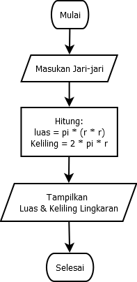
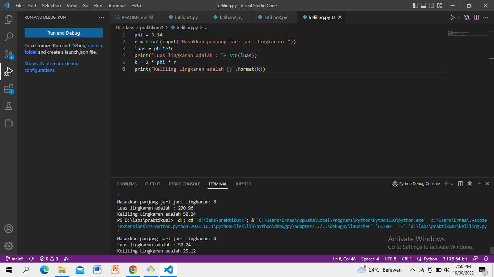

# PRAKTIKUM 3
## Keliling dan Luas Lingkaran
1. # Baris 1 : Mendeklarasikan variable phi dengan nilai 3,14
2. # Baris 2 : Mendeklarasikan variable r serta memasukan nilai jari-jari lingkaran bertipe float yang didapat dari user
3. # Baris 3 : Mendeklarasikan variable luas dimana nilai variable phi tersebut didapat dari perhitungan luas, dimana nilai variable phi dikali nilai variable r lalu dikali dengan variable r dan hasilnya akan dimasukan ke dalam variable luas
4. # Baris 4 : Menampilkan nilai variable luas
5. # Baris 5 : Perhitungan keliling dimana dua dikali dengan nilai variable phi dikali nilai variable r dan hasilnya akan di masukan ke dalam variable k
6. # Baris 6 : Menampilkan nilai dari variable k

## Latihan 1

